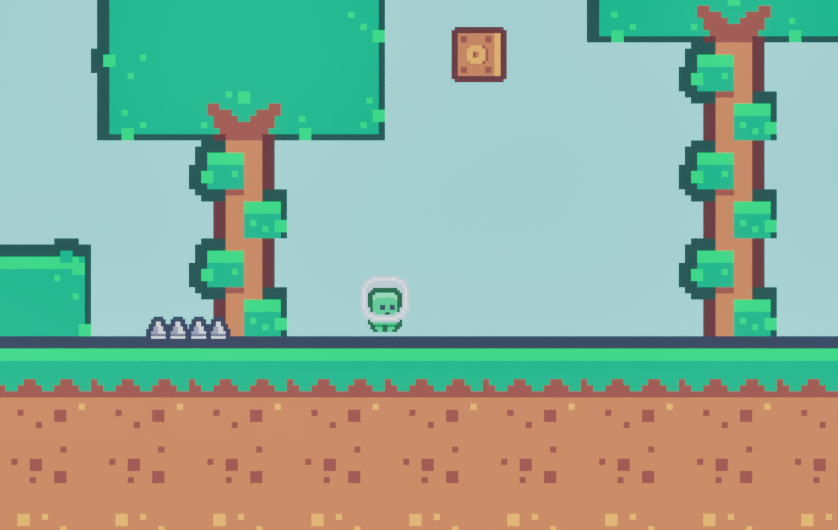
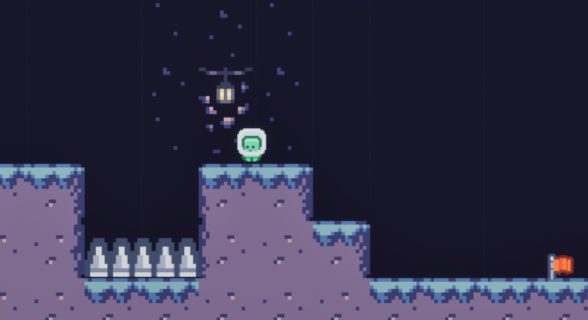
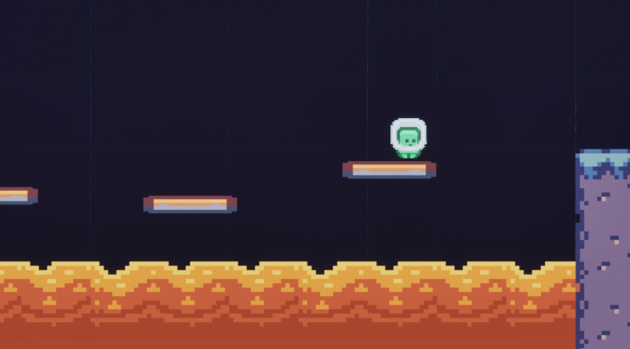
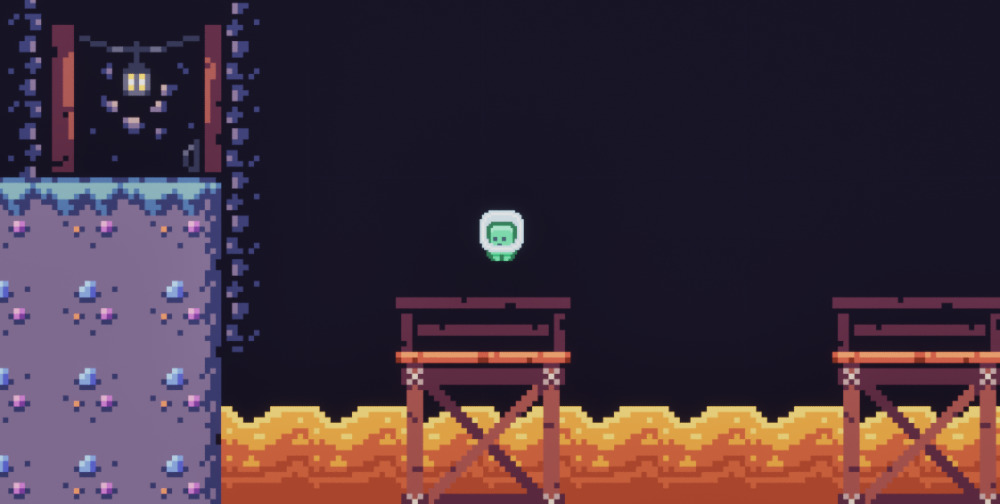

# Pixel Dash 🎮

A side-scrolling platformer built in Unreal Engine 5 using Blueprints.

## Gameplay Features
- Moving platforms
- Enemies and basic AI
- Launch pads
- Check points

## Screenshots
<table>
  <tr>
    <td></td>
    <td></td>
  </tr>
  <tr>
    <td></td>
    <td></td>
  </tr>
    <tr>
    <td></td>
  </tr>
</table>

## How to Play
1. Clone the repo
2. Open `project346.uproject` in Unreal Engine 5
3. Press Play 🎮
